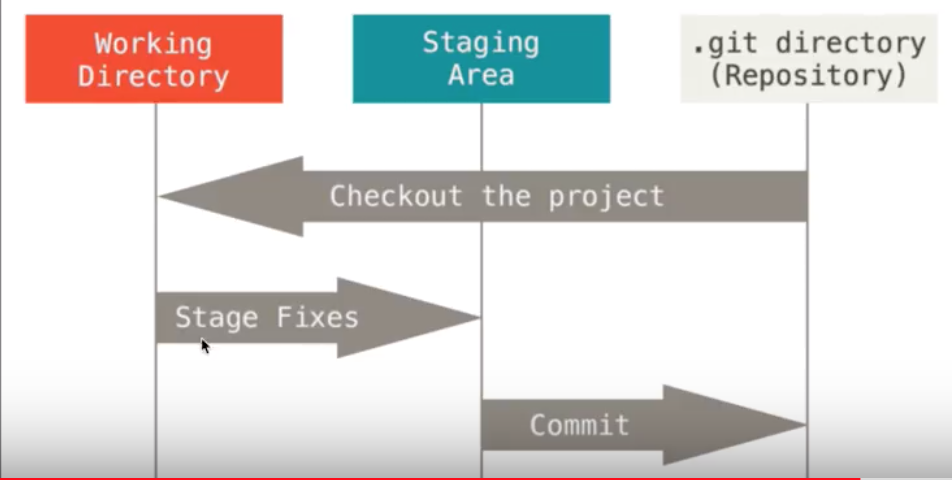
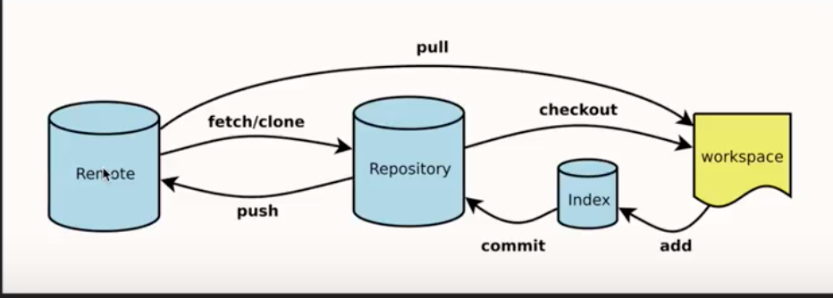
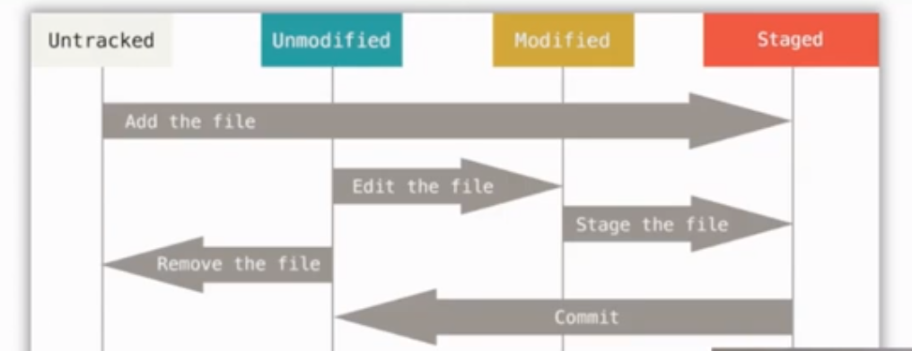

# git

[TOC]

## git是什么






## git基本命令

```
git config用来区分每次提交的用户
git config --global user.name "xiaoshuai xing"
git config --global user.email "xxs@email.com"
查看当前的用户和对应邮箱：
git config --global user.name
git config --global user.email
```


```
git init
初始化git，生成.git目录(在mac下.git文件默认是隐藏的，可以在命令行使用open .git/来打开该目录)
```

```
git status
用来查看git下文件的状态
git status -s 缩略的形式查看文件状态

查看状态的时候一个文件可能出现两个Modify：这个文件修改后先add了，然后又进行了修改。这样的话这个文件就会出现绿色的Modify（staged）和红色的状态（unstaged）
```

```
git add xxxx
将文件从untracked状态到staged状态
git add .  全部新增

```




```
git commit -m "xxxx"
提交代码
```


## 从暂存区回到untracked状态

```
git rm  --cached 文件名
```


## 记录查看log diff

```
git log
查看commit的情况
git log --oneline 查看缩略的commit信息
```

```
git diff
不加参数即默认比较工作区与暂存区的修改

git diff --staged: will only show changes to files in the "staged" area.(最后一次commit时暂存区的状态和现在的暂存区状态的对比)

git diff HEAD: will show all changes to tracked files. (git diff和git diff --staged内容的总和)

git diff HEAD~1 :比较当前commit的版本和前一个版本的差异。如果要比较当前版本和前前一次的话数字改成2即可，依次类推。
```


## 回到过去reset

- 回到add之前

  - **一个文件add后发现有些文件还没有完成，想变成Modify的状态继续修改：**

    git reset 文件名称

- 回到commit之前

  - **本次提交忘记提交了某个文件，将这个文件补充到本次提交：**

    1. 先add这个文件
    2. git commit --amend --no-edit

  - **想回到最后一次commit，并且将暂存区里面的内容清空：**

    git  reset --hard HEAD

  - **回到具体某一次commit：**

    git reset --hard xxxx(commit对应的序号)


## 回到未来

当使用git reset让git回到以前提交的一个版本的时候，想要再回到后来的版本的时候可以使用下面的办法：

**git reflog**

git reset --hard xxx(commit对应的序号)


## 单个文件回到从前checkout

git checkout (commit对应的序号)   --  文件名

 

## 分支 branch

之前编辑的所有改变都是在一条主分支**master**上进行，通常我们会把master当作最终版本，而开发新版本或者新属性的时候，在另一条分支上进行，这样就能使开发和使用互不干扰了。


##  


